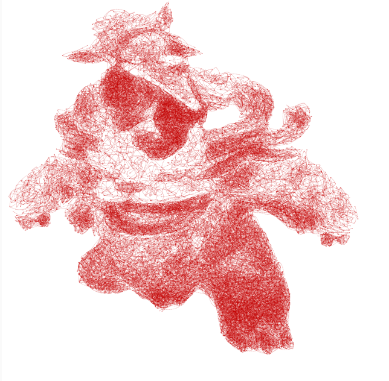

# Scribble-Algorithm
Given an image, convert it into an art style resembling a somwehat chaotic scribble.  
Link To The Project: https://editor.p5js.org/Mandaranian-Cactus/sketches/ZJm7t0Rzn
 Link To The Google Slides: https://docs.google.com/presentation/d/1yjyCjUAWeIc7ZZY3eLvEGj6rT02dQgtN3FMXi1plXrw/edit?usp=sharing
<table>
  <tr>
    <td></td>
    <td></td>
  </tr>
</table>
